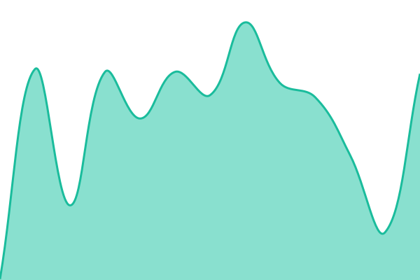

# General Forecast — Status

Live status page for [search.generalforecast.com](https://search.generalforecast.com), powered by [Upptime](https://upptime.js.org) — checks run every 5 minutes via GitHub Actions, no server required.

<!--start: status pages-->
<!-- This summary is generated by Upptime (https://github.com/upptime/upptime) -->
<!-- Do not edit this manually, your changes will be overwritten -->
<!-- prettier-ignore -->
| URL | Status | History | Response Time | Uptime |
| --- | ------ | ------- | ------------- | ------ |
|  [General Forecast Search](https://search.generalforecast.com) | 🟩 Up | [general-forecast-search.yml](https://github.com/generalforecast/status/commits/HEAD/history/general-forecast-search.yml) | 

 180ms
     
 | 

<a href="https://generalforecast.github.io/status/history/general-forecast-search">100.00%</a>
    

<!--end: status pages-->

Powered by [Upptime](https://github.com/upptime/upptime).
